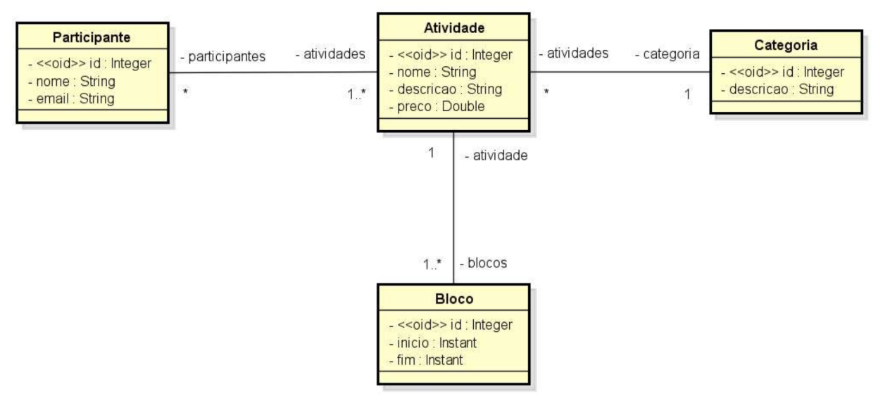

# Desafio: Modelo de Domínio e ORM

Projeto desenvolvido em **Spring Boot** utilizando **Java** e banco de dados em memória **H2**, com o objetivo de implementar um sistema para gerenciar as informações dos participantes e atividades de um evento acadêmico. Este projeto inclui o modelo conceitual especificado e um seeding da base de dados conforme o diagrama de objetos.

---

## Especificação do Sistema: EVENTO

O sistema gerencia as informações de um evento acadêmico, composto por diversas atividades e participantes.

### Entidades e Regras:

#### Atividade
- **Atributos:**
    - `nome` (String): Nome da atividade.
    - `descricao` (String): Descrição detalhada.
    - `preco` (Double): Preço para participar da atividade.
- **Blocos de Horário:**
    - Cada atividade pode conter múltiplos blocos, onde cada bloco possui:
        - `inicio` (instant): Horário de início.
        - `fim` (instant): Horário de término.

#### Participante
- **Atributos:**
    - `nome` (String): Nome completo do participante.
    - `email` (String): Endereço de e-mail do participante.

---

## Tecnologias Utilizadas

- **Java** 17+
- **Spring Boot** 3.x
- **JPA/Hibernate** (mapeamento ORM)
- **H2 Database** (banco de dados em memória para desenvolvimento e testes)
- **Spring Data JPA** (acesso a dados)
- **Maven** (gerenciador de dependências)

---
## Diagrama de objetos

---

## Autor
Desenvolvido por **Andre Proenca** como parte do estudo do framework **Spring Boot** e práticas de desenvolvimento backend.